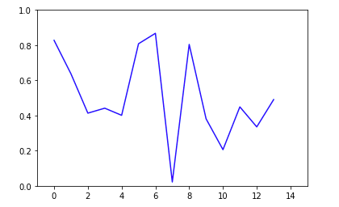

# Sentiment Analysis and NLP #

This project creates a model which analyses the input text entry, generates an score and classifies as negative or positive. Finally, for paragraphs of text, the model generates an average score and then uses this average score to plot graphs.

## Prerequisites ##

* I have included a Jupyter Notebook file (.ippynb) in the 'nlp' directory, so, you will need to install Jupyter Notebook in order to run it. Follow the link below to get Jupyter Notebook.

    https://jupyter.org/install 

* If you already have anaconda installed on your machine, simply use the included conda environment to run the program. If not, you may install the libraries mentioned later. If you wish to include Anaconda, follow the link below.
    
    https://www.anaconda.com/distribution/
    
* You may manually install the following libraries:
    1. Pandas
    2. Keras
    3. Gensim
    4. NLTK
    
## Basic Output ##

The most basic output that can be generated from the following code are:

#### Find similar words ####
<pre><code> word2vec_model.wv.most_similar("boy")
</code></pre>

#### Output for similar words ####
<pre><code>[('girl', 0.5939455032348633),
 ('kid', 0.46119511127471924),
 ('guy', 0.4250742495059967),
 ('boys', 0.4113749861717224),
 ('baby', 0.3948898911476135),
 ('man', 0.3948540687561035),
 ('brother', 0.3793013095855713),
 ('boyfriend', 0.3651091456413269),
 ('girls', 0.3623187839984894),
 ('son', 0.34856101870536804)]</code></pre>
 
 #### Analyse sentence sentiments ####
 <pre><code>predict('I love going to school')</code></pre>
 
  #### Output for sentiment analysis ####
 <pre><code>{'label': 'POSITIVE',
 'score': 0.6806764006614685,
 'elapsed_time': 0.1733388900756836}</code></pre>
 
 #### Graph for multiple scores ####
 
 
 
 ## Built with ##
 
 * [Named Link](https://jupyter.org "Jupyter Notebook") - Used to display the results of the program
 * [Named Link](http://keras.io "Keras Library") - Python Deep Learning Library 
 
  ## References ##
  
  1. Dataset - Named Link](https://www.kaggle.com/kazanova/sentiment140 "1.6 million Twitter Sentiments")
  2. Reference Tutorial - Named Link](https://www.kaggle.com/paoloripamonti/twitter-sentiment-analysis/comments "Twitter Sentiment Analysis")
 
 ## Acknowledgements ##
 
 * Thanks to @sohaamutsaddi for handling the complete documentation
 
